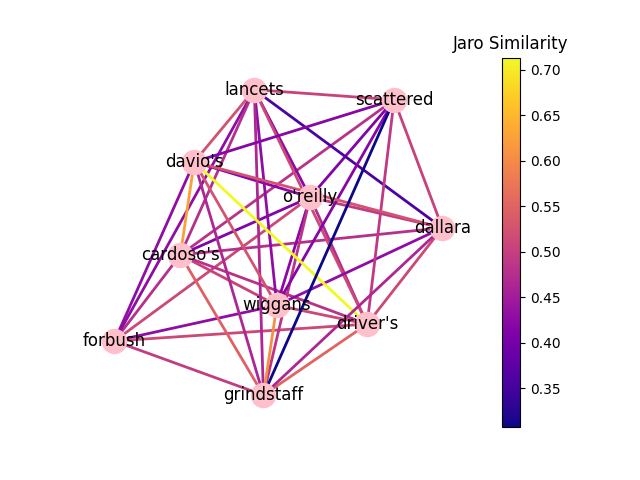
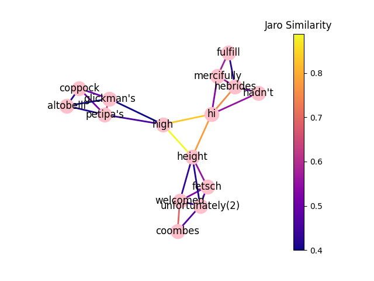
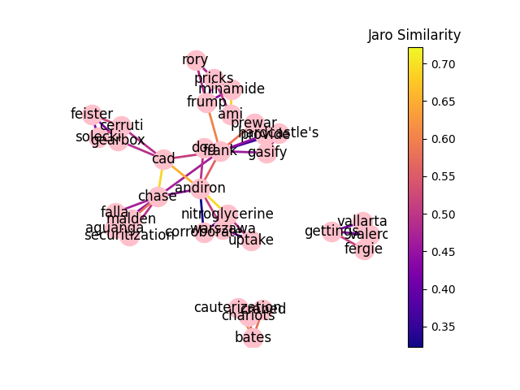

# [CMUDaaN](https://cjk5642.github.io/CMUDaaN/)
CMU Dictionary as a Network (CMUDaaN) is a lightweight library that reframes the CMU Dictionary as network consisting of weighted edges by proportional matching and words as nodes.

## How it works
Each word given by the CMU Dict is broken down into syllables. In Pythonic terms, for each word, there is a list of syllables that represent that word. Therefore, for ``n`` words, we now have ``(n * n-1) / 2`` combinations without replacement of words to be studied against using similarity metrics. The metric chosen for this was Jaro Similarity since this produced a number between 0 and 1 and made relative sense with respect to this topic.

## Examples
### ``graph_random(...)``
Using the function ``graph(n = 10, show = True)``, you can create a network like the following:
<p align="center">
  
</p>
This selects 10 random words and establishes connections to them through Jaro Similarity. If the similarity is 0, no connection is made.

### ``graph_wordlist(...)``
Using the following code:
```python
wordlist = ['hi', 'high', 'height']
g = graph_wordlist(wordlist = wordlist, n = 4, communities = True, show = True)
```
you obtain the following graph:
<p align='center'>
  
</p>

### ``graph_synonym(...)``
Using the following code:
```python
word = 'dog'
g = graph_synonym(word, communities=True, n_synonyms=None, n = 4, show = True)
```
you obtain the following graph:
<p align='center'>
  
</p>
